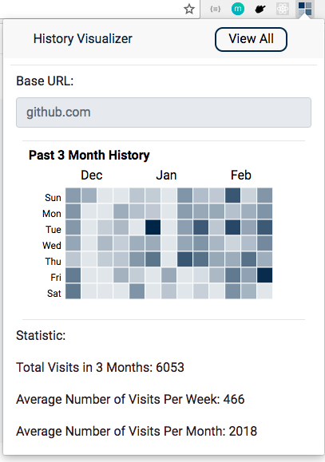

# Visualize Your History

Chrome extension written in Typescript with TSX that visualizes the user's browsing history.


###### WORK IN PROGRESS: Not stable until v1.0.0

--- 


## Installation

```
git clone https://github.com/bdinh/visualize-history-extension.git
```

The folder required to utilize the extension locally is within the build directory.
To see how to load an extension locally, visit [Chrome's Getting Started Tutorial](https://developer.chrome.com/extensions/getstarted).

For the sake of this version, do __not rebuild__ the source code. The current build folder
contains two separate builds. This is the case due to the fact that this project was initially
created with `react-create-app-typescript`. The codebase is currently being migrated in order to create
multiple endpoint builds. 
 
## Getting Started 

Once installed, the extension will visualize and create summary visualization 
in a popup that allows the user to quickly view their browsing habits given a base url.

Below is an example of the extension in use:




